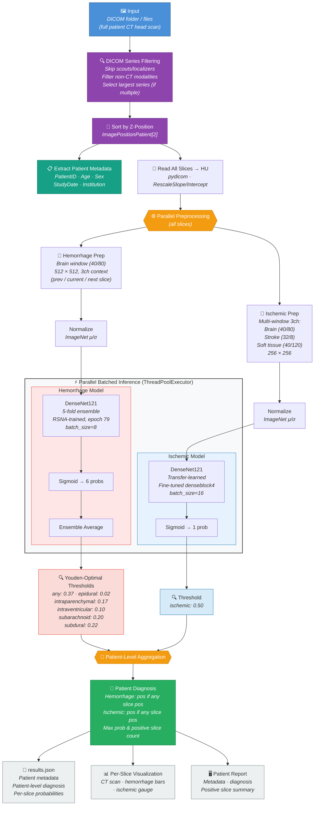

```mermaid
flowchart TD
    INPUT["🖼️ Input<br/><i>DICOM folder / files</i><br/><i>(full patient CT head scan)</i>"]
    
    INPUT --> FILTER["🔍 DICOM Series Filtering<br/><i>Skip scouts/localizers</i><br/><i>Filter non-CT modalities</i><br/><i>Select largest series (if multiple)</i>"]
    
    FILTER --> SORT["📐 Sort by Z-Position<br/><i>ImagePositionPatient[2]</i>"]
    
    SORT --> META["📋 Extract Patient Metadata<br/><i>PatientID · Age · Sex</i><br/><i>StudyDate · Institution</i>"]
    
    SORT --> READ["📖 Read All Slices → HU<br/><i>pydicom · RescaleSlope/Intercept</i>"]
    
    READ --> PREP{{"⚙️ Parallel Preprocessing<br/><i>(all slices)</i>"}}
    
    PREP --> HEM_PREP["🧠 Hemorrhage Prep<br/><i>Brain window (40/80)</i><br/><i>512 × 512, 3ch context</i><br/><i>(prev / current / next slice)</i>"]
    PREP --> ISC_PREP["🧠 Ischemic Prep<br/><i>Multi-window 3ch:</i><br/><i>Brain (40/80)</i><br/><i>Stroke (32/8)</i><br/><i>Soft tissue (40/120)</i><br/><i>256 × 256</i>"]
    
    HEM_PREP --> NORM1["Normalize<br/><i>ImageNet μ/σ</i>"]
    ISC_PREP --> NORM2["Normalize<br/><i>ImageNet μ/σ</i>"]
    
    NORM1 --> HEM_MODEL
    NORM2 --> ISC_MODEL
    
    subgraph PAR["⚡ Parallel Batched Inference (ThreadPoolExecutor)"]
        direction LR
        subgraph HEM["Hemorrhage Model"]
            HEM_MODEL["DenseNet121<br/><i>5-fold ensemble</i><br/><i>RSNA-trained, epoch 79</i><br/><i>batch_size=8</i>"]
            HEM_MODEL --> HEM_SIG["Sigmoid → 6 probs"]
            HEM_SIG --> HEM_AVG["Ensemble Average"]
        end
        
        subgraph ISC["Ischemic Model"]
            ISC_MODEL["DenseNet121<br/><i>Transfer-learned</i><br/><i>Fine-tuned denseblock4</i><br/><i>batch_size=16</i>"]
            ISC_MODEL --> ISC_SIG["Sigmoid → 1 prob"]
        end
    end
    
    HEM_AVG --> HEM_THRESH["🔍 Youden-Optimal Thresholds<br/><i>any: 0.37 · epidural: 0.02</i><br/><i>intraparenchymal: 0.17</i><br/><i>intraventricular: 0.10</i><br/><i>subarachnoid: 0.20</i><br/><i>subdural: 0.22</i>"]
    ISC_SIG --> ISC_THRESH["🔍 Threshold<br/><i>ischemic: 0.50</i>"]
    
    HEM_THRESH --> AGG{{"🔗 Patient-Level Aggregation"}}
    ISC_THRESH --> AGG
    
    AGG --> PATIENT_DX["🏥 Patient Diagnosis<br/><i>Hemorrhage: pos if any slice pos</i><br/><i>Ischemic: pos if any slice pos</i><br/><i>Max prob & positive slice count</i>"]
    
    PATIENT_DX --> JSON["📄 results.json<br/><i>Patient metadata</i><br/><i>Patient-level diagnosis</i><br/><i>Per-slice probabilities</i>"]
    PATIENT_DX --> VIS["📊 Per-Slice Visualization<br/><i>CT scan · hemorrhage bars</i><br/><i>· ischemic gauge</i>"]
    PATIENT_DX --> CONSOLE["🖥️ Patient Report<br/><i>Metadata · diagnosis</i><br/><i>Positive slice summary</i>"]

    style INPUT fill:#4a90d9,color:#fff,stroke:#2c5f8a
    style FILTER fill:#8e44ad,color:#fff,stroke:#6c3483
    style SORT fill:#8e44ad,color:#fff,stroke:#6c3483
    style META fill:#16a085,color:#fff,stroke:#117a65
    style PREP fill:#f39c12,color:#fff,stroke:#d68910
    style PAR fill:#f8f9fa,stroke:#555,stroke-width:2px
    style HEM fill:#ffe6e6,stroke:#e74c3c
    style ISC fill:#e6f3ff,stroke:#2980b9
    style AGG fill:#f39c12,color:#fff,stroke:#d68910
    style PATIENT_DX fill:#27ae60,color:#fff,stroke:#1e8449
    style JSON fill:#ecf0f1,stroke:#7f8c8d
    style VIS fill:#ecf0f1,stroke:#7f8c8d
    style CONSOLE fill:#ecf0f1,stroke:#7f8c8d
    style HEM_THRESH fill:#fadbd8,stroke:#e74c3c
    style ISC_THRESH fill:#d6eaf8,stroke:#2980b9
```
